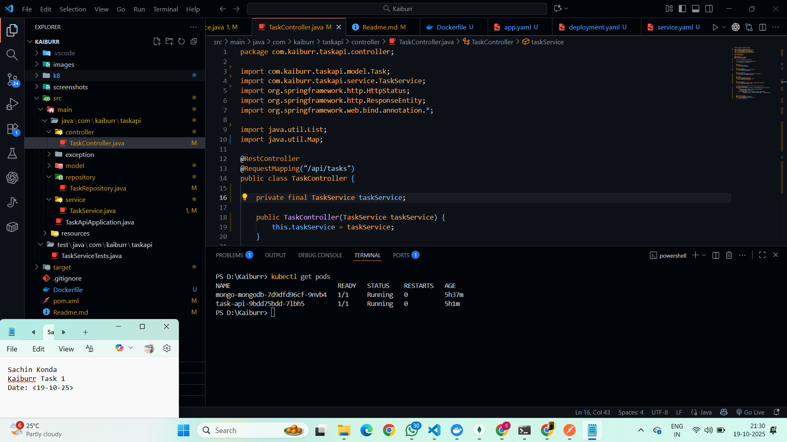
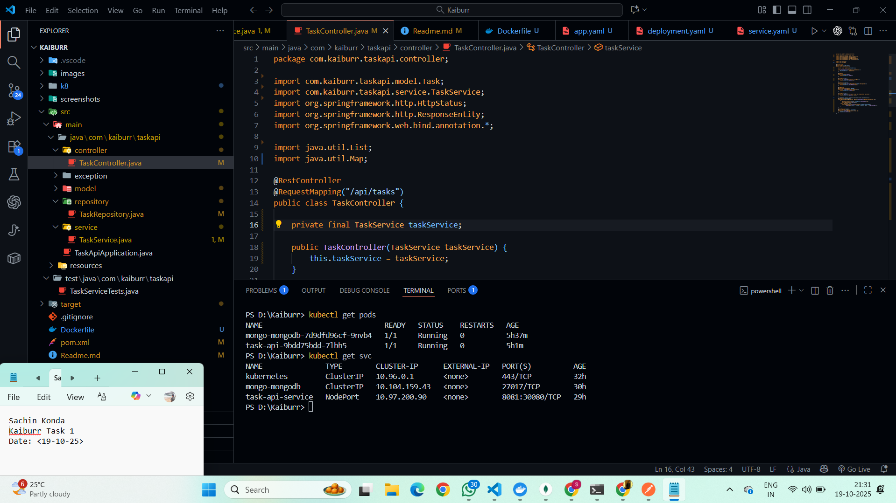
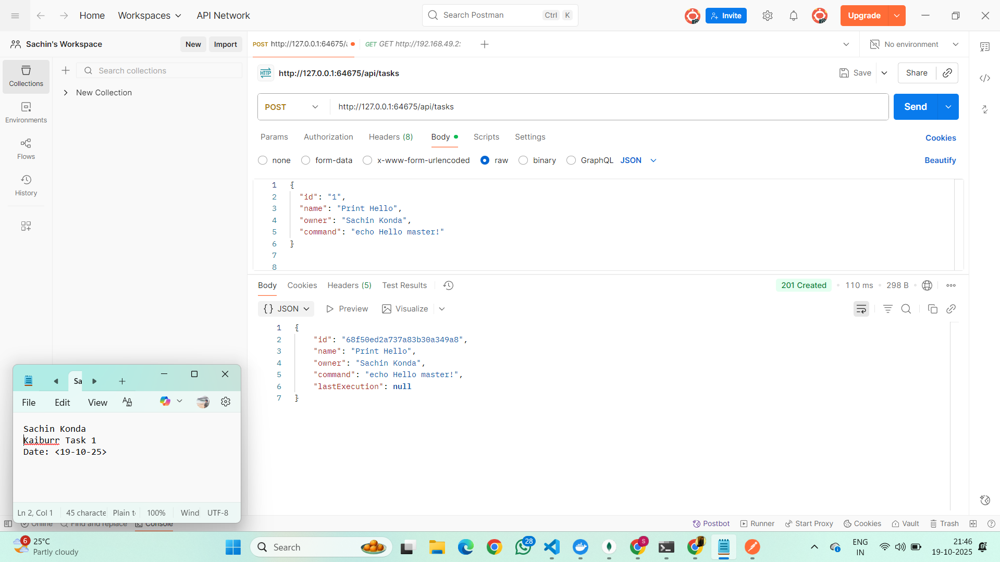
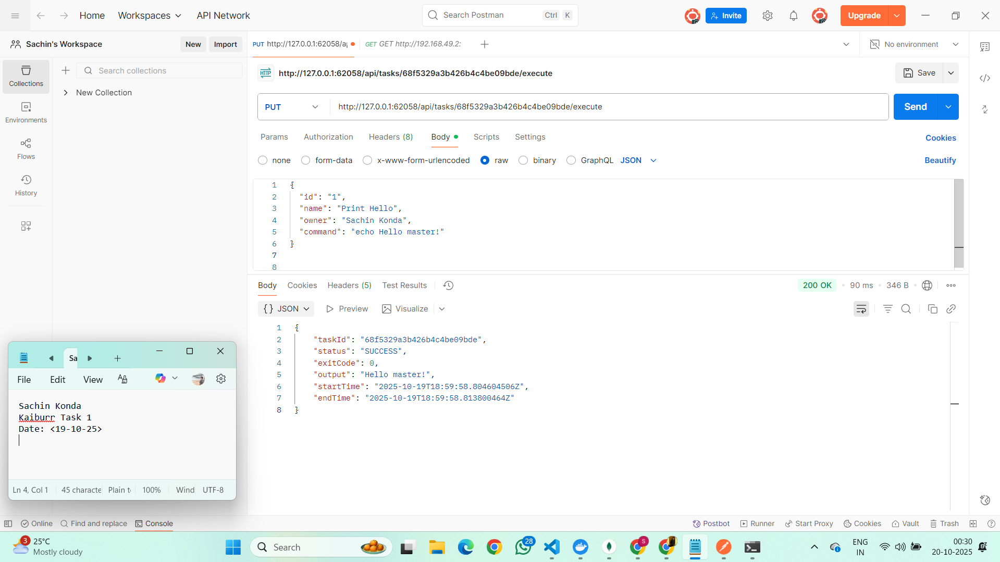
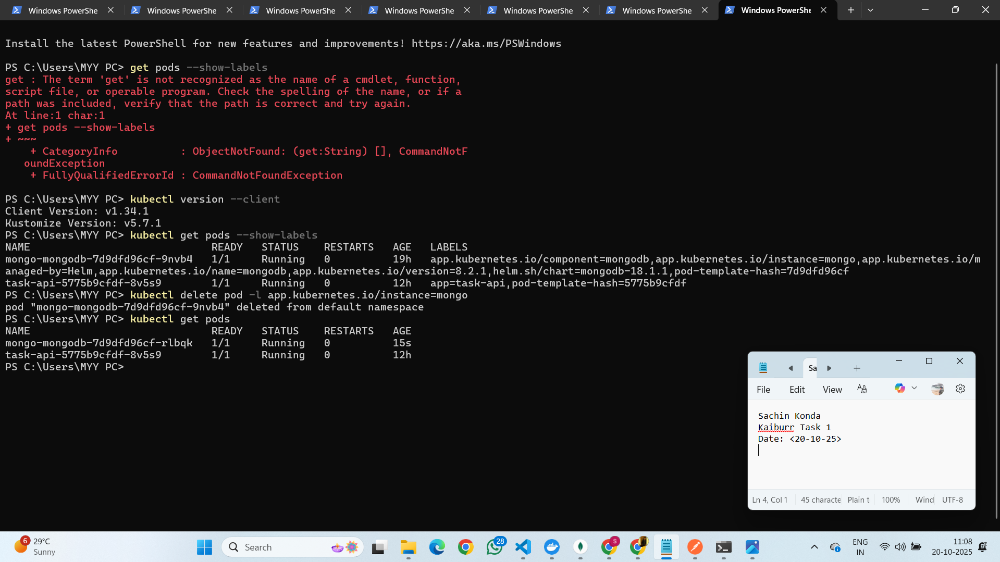

# Kaiburr Assessment – Tasks 1 to 4

Personal submission for the Kaiburr hiring assessment. The repository contains:

- **Task 1** – Spring Boot REST API with MongoDB persistence and command execution
- **Task 2** – Docker image + Kubernetes manifests, including BusyBox pod execution
- **Task 3** – React 19 + TypeScript + Ant Design web console
- **Task 4** – Automated CI/CD pipeline (GitHub Actions) with Maven, npm, and Docker build steps

All code was authored and verified by me. Screenshots and (optional) video evidence with my name and current timestamp will be attached before submission, per Kaiburr’s requirements.

> ⚠️ Keep this repository private until submission. Do not share code or assets with other candidates.

---

## Table of Contents

1. [Project Structure](#project-structure)  
2. [Screenshots & Demo Video](#screenshots--demo-video)  
3. [Task 1 – Spring Boot REST API](#task1--spring-boot-rest-api)  
4. [Task 2 – Kubernetes Deployment](#task2--kubernetes-deployment)  
5. [Task 3 – React Web UI](#task3--react-web-ui)  
6. [Task 4 – CI/CD Pipeline](#task4--cicd-pipeline)  
7. [Quality Gates & Troubleshooting](#quality-gates--troubleshooting)  
8. [Submission Checklist](#submission-checklist)

---

## Project Structure

```
.
├── .github/workflows/ci.yml      # GitHub Actions pipeline (Task 4)
├── Dockerfile                    # Spring Boot container image (Task 2)
├── frontend/                     # React 19 + Ant Design UI (Task 3)
├── images/                       # API/Kubernetes evidence (Task 1 & 2)
├── fronted-images/               # UI screenshots (Task 3)
├── k8/                           # Kubernetes manifests (Task 2)
├── pom.xml                       # Maven descriptor
├── src/                          # Java source, configs, tests
└── README.md                     # This document
```

---

## Screenshots & Demo Video

Each screenshot must include **my name** and the **current date/time** (system clock, terminal prompt, etc.). Replace the placeholders below before submission.

### Backend & Kubernetes Evidence (`images/`)

| Scenario | Screenshot |
| --- | --- |
| Kubernetes pods |  |
| Kubernetes services |  |
| API browser output |  |
| Postman – create task |  |
| Postman – execute task |  |
| MongoDB Compass |  |
| Persistent volume verification |  |
| CI/CD pipeline run |  |

### Frontend Evidence (`fronted-images/`)

| View | Screenshot |
| --- | --- |
| Dashboard |  |
| Create task modal |  |
| Command execution modal |  |
| Success notification |  |
| Search results |  |
| Delete confirmation |  |
| Post-delete state |  |

### Demo Video (Optional but recommended)

[](https://example.com/TODO_demo_video_url)  
_(Update the link and thumbnail once the recording is ready. Ensure the frame shows name + timestamp.)_

---

## Task 1 – Spring Boot REST API

### Start the API locally

```powershell
mvn spring-boot:run
```

Default URL: `http://localhost:8081/api/tasks`

Endpoints:
- `GET /api/tasks` – list (supports `?name=` filter)
- `GET /api/tasks/{id}` – fetch single task
- `POST /api/tasks` – create (validates required fields)
- `PUT /api/tasks/{id}` – update
- `DELETE /api/tasks/{id}` – remove
- `PUT /api/tasks/{id}/execute` – run command and capture output

Execution flow:
1. Try to create a temporary BusyBox pod via Kubernetes Java client.  
2. If Kubernetes is unavailable, fall back to local shell execution with `ProcessBuilder`.  
3. Persist `startTime`, `endTime`, and `output` in `TaskExecution`.  
4. Store task + execution details in MongoDB (`kaiburrdb` by default).

### Run backend tests

```powershell
mvn test
```

Tests include unit coverage for command execution fallback and a Spring Boot context load.

---

## Task 2 – Kubernetes Deployment

### Build the Docker image

```powershell
mvn -DskipTests clean package
docker build -t kaiburr-task-api:latest .
```

### Deploy to Minikube

```powershell
minikube start --driver=docker
kubectl apply -f k8/app.yaml        # config map, secrets, PVC
kubectl apply -f k8/deployment.yaml # Spring Boot deployment
kubectl apply -f k8/service.yaml    # NodePort/LoadBalancer service
```

Verify:
```powershell
kubectl get pods
kubectl get svc
minikube service task-api-service --url
```

Use curl/Postman against the exposed URL, capture screenshots, and confirm MongoDB data survives pod restarts (PVC bound to Mongo deployment).

---

## Task 3 – React Web UI

### Development Server

```powershell
cd frontend
npm install          # or npm ci
npm run dev
```

Open http://localhost:5173. The UI targets `http://localhost:8081/api` by default. Override via `.env`:
```
VITE_API_BASE_URL=http://localhost:8081/api
```

### Production Build & Checks

```powershell
npm run lint
npm run build
```

Features:
- Task table with sorting, responsive layout, and accessible actions
- Modal form with validation and server error surfacing
- Drawer view showing command history
- Execution modal with output, exit code, timestamps, and copy support

---

## Task 4 – CI/CD Pipeline

Pipeline definition lives at `.github/workflows/ci.yml` and is intentionally limited to **local-style build verification** (no cloud deploy step). It runs automatically for pushes and pull requests to `main`.

Stages:
1. **Checkout** repo
2. **MongoDB service** – run a disposable container so backend tests can connect
3. **Backend build/test** – set up Temurin JDK 17 and execute `mvn clean package`
4. **Frontend lint/build** – set up Node.js 22, run `npm ci`, `npm run lint`, `npm run build`
5. **Docker build** – build the local deployment image `taskapi:${{ github.sha }}`

You can execute the same workflow locally using [act](https://github.com/nektos/act):

```powershell
act -j build
```

(Requires Docker; cache paths can be customised if necessary.)

Capture the successful GitHub Actions run and replace `images/TODO_pipeline.png`.

---

## Quality Gates & Troubleshooting

| Command | Purpose |
| --- | --- |
| `mvn clean package` | Compile + run backend unit tests |
| `mvn test` | Execute backend test suite only |
| `npm run lint` | ESLint check for React app |
| `npm run build` | Type-check and build production UI bundle |
| `docker build -t kaiburr-task-api:local .` | Verify container build locally |

### Common Issues

| Problem | Fix |
| --- | --- |
| Port 8081 already in use | Stop existing Spring Boot instance (`netstat -ano | findstr 8081` then `taskkill /PID <pid> /F`) |
| API execution still fails with Kubernetes error | Ensure you restarted after the fallback change; log should show “Kubernetes execution failed, attempting local execution instead” |
| MongoDB connection refused | Update `SPRING_DATA_MONGODB_URI` or start MongoDB container/service |
| Frontend cannot reach API | Update `.env` with the correct base URL and restart `npm run dev` |
| GitHub Actions Maven step fails | Confirm MongoDB service is healthy; rerun pipeline |

---

## Submission Checklist

- [ ] Update screenshot placeholders with files containing name + timestamp  
- [ ] Upload demo video and link it in this README (optional but recommended)  
- [ ] Ensure README, manifests, and code are committed and pushed  
- [ ] Verify GitHub Actions pipeline succeeds on latest commit  
- [ ] Submit repository link via Kaiburr form

---

© 2025 Kaiburr LLC. All rights reserved. Submitted solely for recruitment evaluation.
