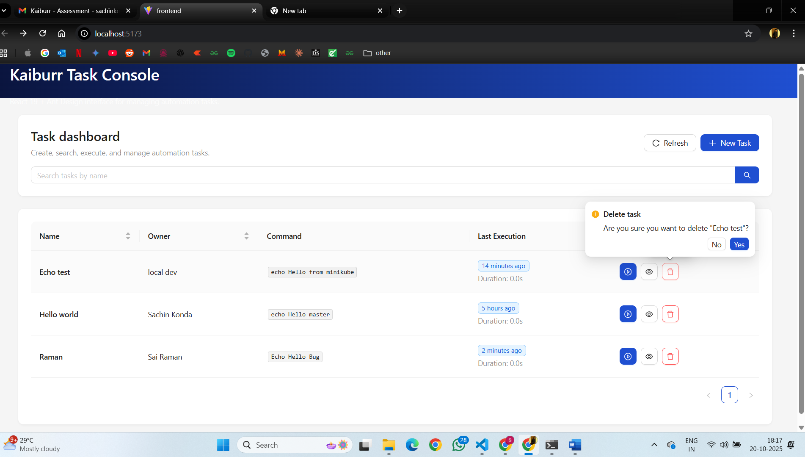
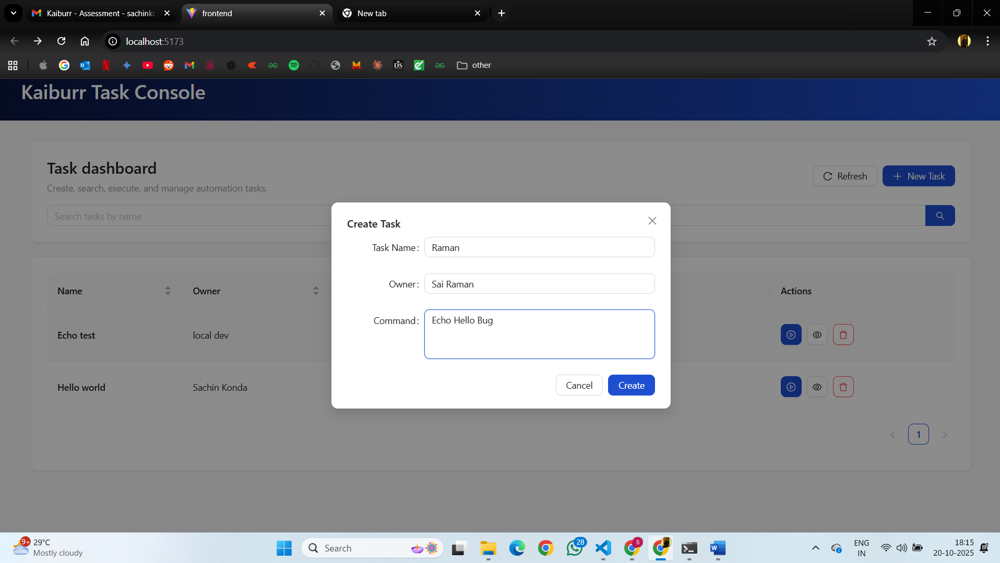
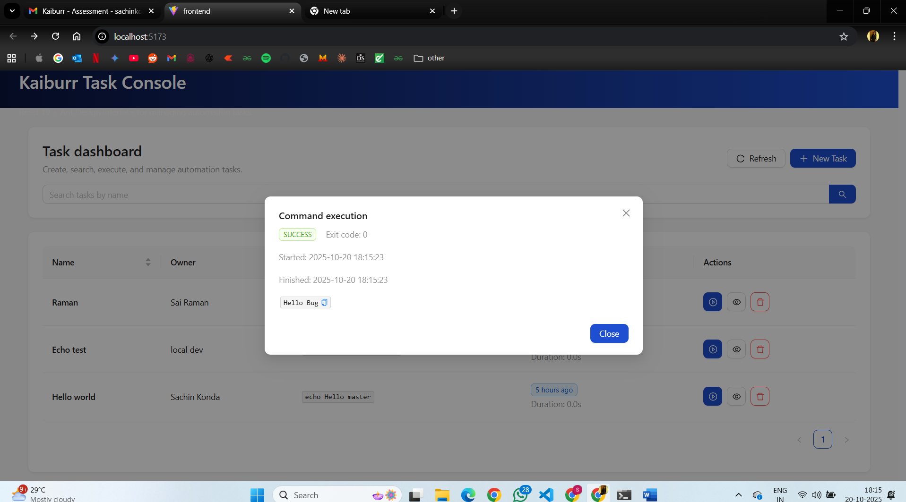
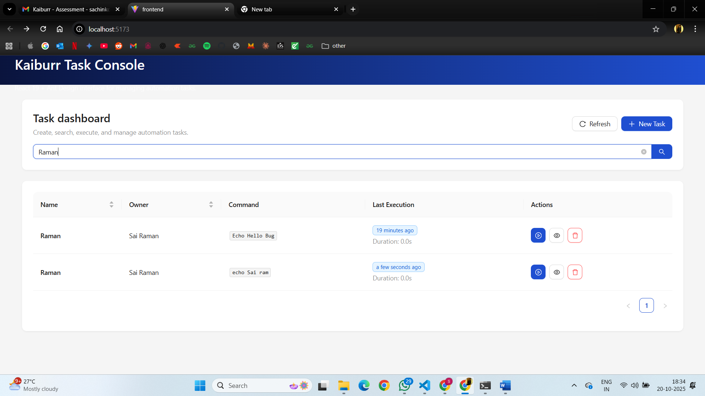
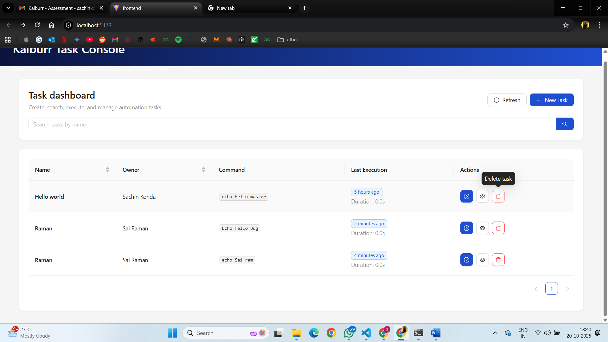

# Kaiburr Task 3: WEB UI Forms

##  Objective
Build a **React 19 + TypeScript + Ant Design** web frontend for the backend service created in **Task 1**.  
The app must allow users to:
- **Create**, **view**, **search**, and **delete** task records  
- **Run commands** and display their output  
- Focus on **usability** and **accessibility**

---

##  Tech Stack
| Component | Technology |
|------------|-------------|
| Frontend Framework | React 19 (with Vite) |
| Language | TypeScript |
| UI Library | Ant Design v5 |
| HTTP Client | Axios |
| State Management | React Query / useState |
| Backend API | Java Spring Boot REST API (Task 1) |
| Database | MongoDB |

---

##  Project Structure
```
frontend/
├── dist/
├── node_modules/
├── public/
├── src/
│   ├── features/
│   ├── services/
│   ├── types/
│   ├── App.tsx
│   ├── index.css
│   └── main.tsx
├── .env.example
├── .gitignore
├── eslint.config.js
├── index.html
├── package.json
├── package-lock.json
├── tsconfig.json
├── tsconfig.app.json
├── tsconfig.node.json
└── vite.config.ts


```

---

##  Run instructions

### 1️ Clone the Repository
```bash
git clone https://github.com/<your-username>/kaiburr-task3-webui.git
cd kaiburr-task3-webui
```

### 2️ Install Dependencies
```bash
npm install
```

### 3️ Configure Environment Variables
Create a file called `.env` in the project root:
```bash
VITE_API_BASE_URL=http://localhost:8080/api
```

### 4️ Run the App
```bash
npm run dev
```
Open your browser at **http://localhost:5173/**

---

##  Key Features
### Create Task
Form fields: ID, Name, Owner, Command → POST to `/tasks`

###  Search Tasks
Search by substring → GET `/tasks/search?name=<string>`

###  View All Tasks
Table columns: ID, Name, Owner, Command, Actions

###  Delete Task
Delete record → DELETE `/tasks/{id}` with confirmation dialog

###  Run Command
Execute command → PUT `/tasks/{id}/execute`, display output in modal

###  Command Output
Displays latest TaskExecution history and command logs


---

##  Screenshots 

### Dashboard
 
 
### Task Creation



### Run the task


### Submission and success message 
 

### Search
 

### Delete
 

### After delete
 


---

##  Testing
```bash
npm run lint
npm run test
```

---

##  Build for Production
```bash
npm run build
```
Static files will be available in `/dist`.

---


