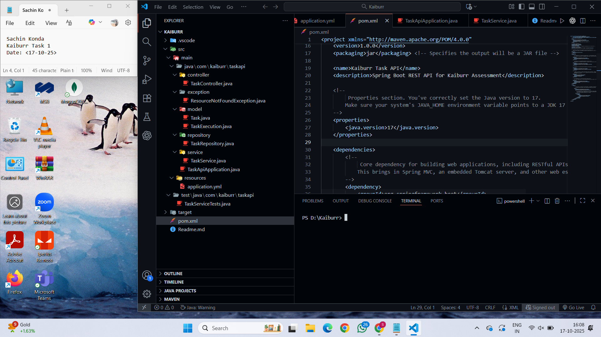
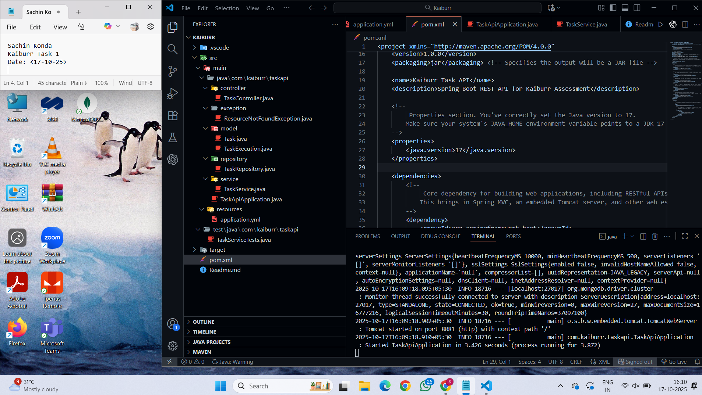
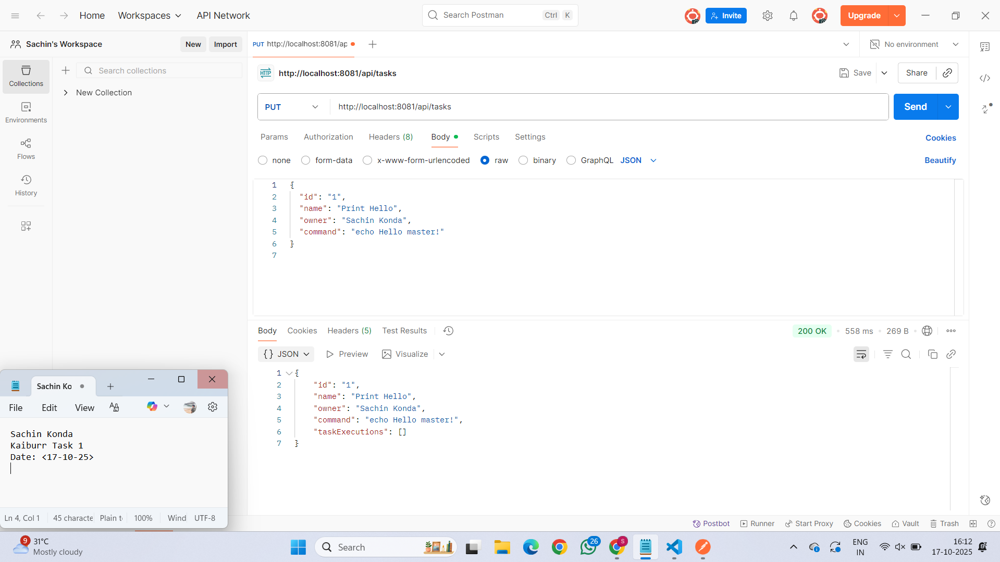
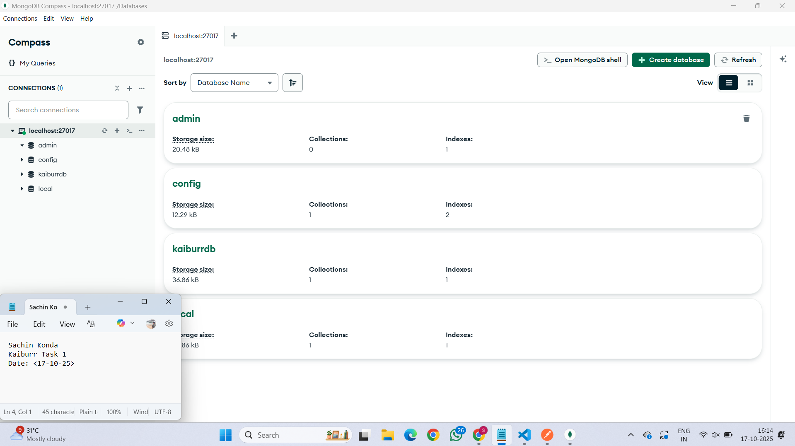
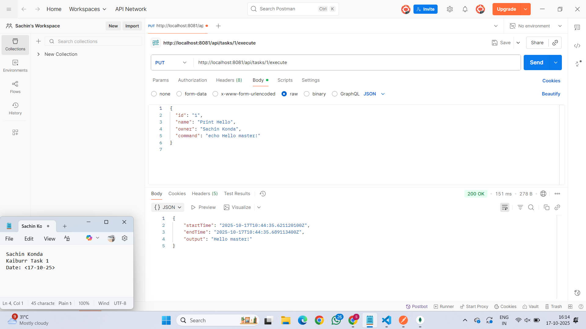
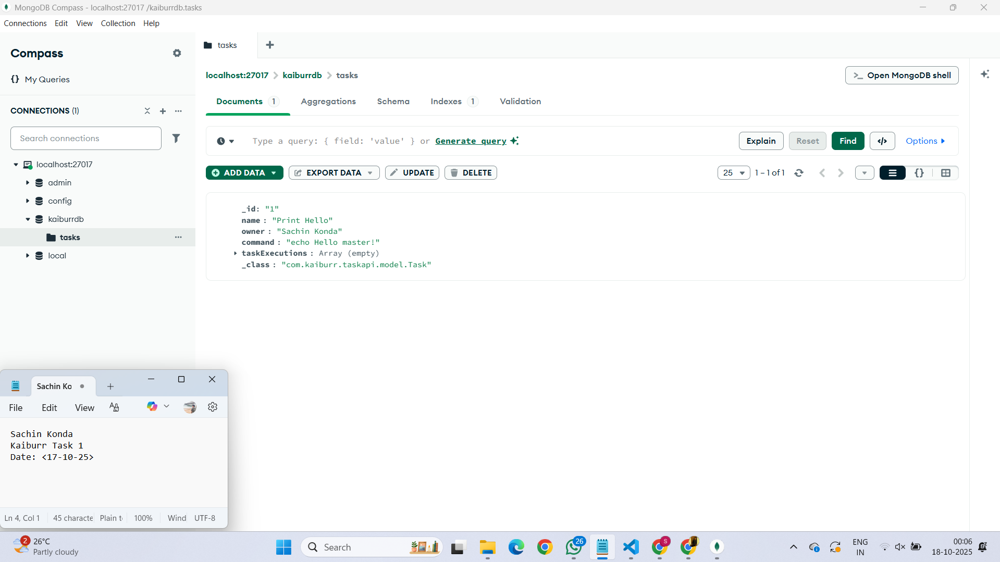
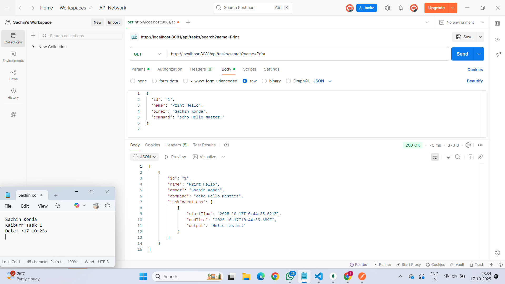
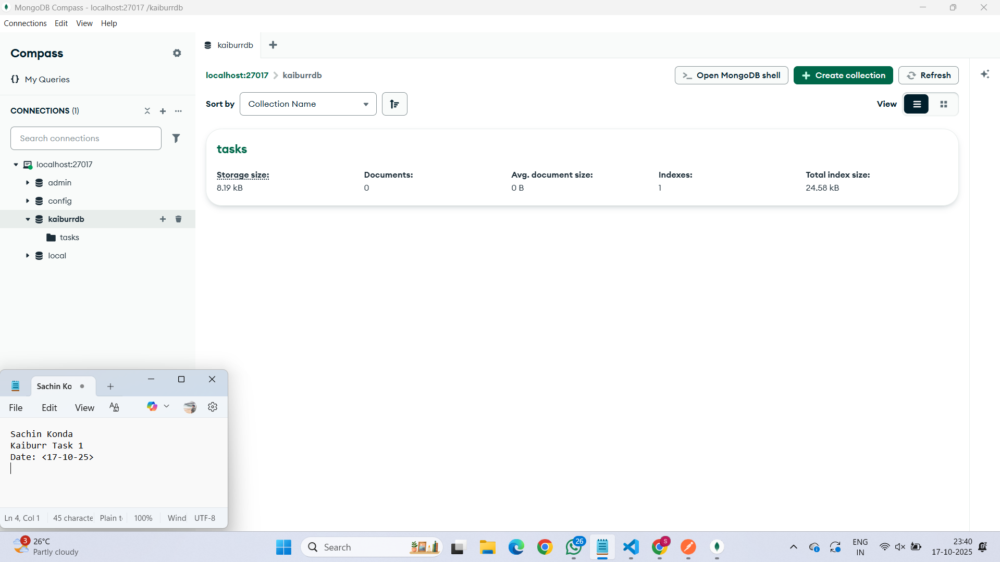

# Kaiburr Task 1 – RESTful API Using Spring Boot and MongoDB

## Overview

This project implements a RESTful web service for task management using **Spring Boot** and **MongoDB**.  
Each task contains metadata such as an identifier, name, owner, and a system command.  
The API allows creating, updating, retrieving, searching, executing, and deleting tasks.  
When a command is executed, the application runs it securely on the host machine and records the execution output along with timestamps.

This solution demonstrates proficiency in backend development, API design, and database integration using industry-standard frameworks.

---

## Key Features

- Implementation of RESTful CRUD operations using Spring Boot.
- Integration with MongoDB for persistent storage.
- Command execution with validation and safe-execution controls.
- Comprehensive API endpoints for managing and querying tasks.
- Execution history logging with timestamps and command outputs.
- Cross-platform support for Windows and Linux command execution.

---

## Technologies Used

| Category | Technology |
|-----------|-------------|
| Programming Language | Java (JDK 17 or higher) |
| Framework | Spring Boot 3.3.0 |
| Database | MongoDB 6.x (Local Instance) |
| Build Tool | Apache Maven 3.9+ |
| Testing Tool | Postman |
| IDE | Visual Studio Code / IntelliJ IDEA |

---

## System Requirements

- **Java 17 or later** installed and configured in the system `PATH`.  
- **MongoDB** running locally on `localhost:27017`.  
- **Maven** properly configured for dependency management.  
- **Postman** or any HTTP client for testing API endpoints.

---

## Project Setup and Execution

1. Clone the repository or download the source code:
   ```bash
   git clone https://github.com/<your-username>/kaiburr-task1.git
   cd kaiburr-task1

## Screenshots

Below are the screenshots demonstrating the execution and results of the Kaiburr Task 1 API.  
Each screenshot includes the current date/time and my name as per the submission requirements.

### 1. Project Structure


### 2. Application Running on Port 8081


### 3. Create Task – PUT /api/tasks


### 4. MongoDB After Task Creation


### 5. Execute Task – PUT /api/tasks/{id}/execute


### 6. MongoDB After Execution


### 7. Search Task – GET /api/tasks/search?name=Print


### 8. Delete Task – DELETE /api/tasks/{id}


### 9. MongoDB After Delete

